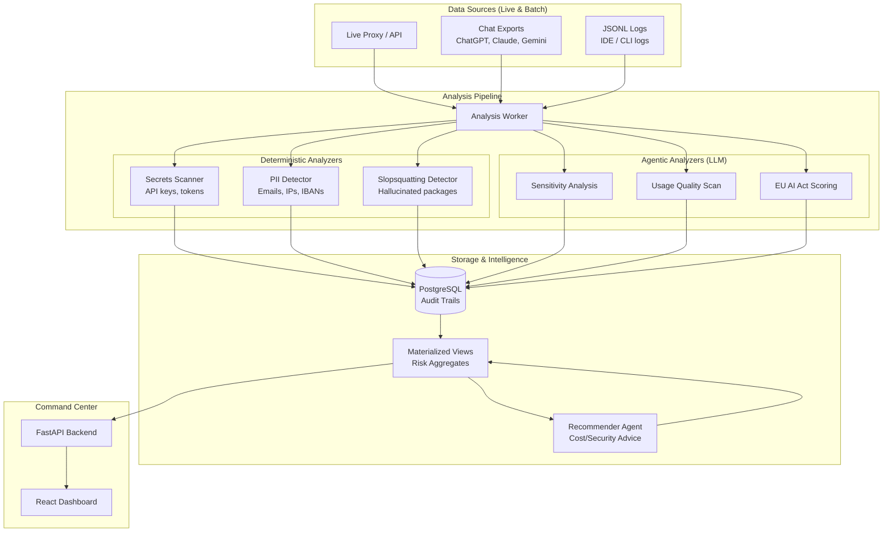

# ARGUS — AI Usage Intelligence Platform
## Governing AI adoption — before liability hits.

[](https://www.docker.com/)
[](LICENSE)
[](#-eu-ai-act-readiness)
[](https://python.org)
[](https://fastapi.tiangolo.com)
[](https://react.dev)
[](https://vitejs.dev)
[](https://typescriptlang.org)
[](https://bun.sh)
[](https://postgresql.org)
[](https://docker.com)


---

### 🛡️ The Mission
**Your employees are using ChatGPT, Claude, and Gemini every day.** They're pasting source code, customer data, and internal documents. That data is leaving your company right now, without visibility and without control.

This isn't a hypothetical. This is reality. Leaked secrets, hallucinated packages entering your codebase, and spiraling costs. **ARGUS makes all of this visible.** We help companies govern AI adoption before it becomes a liability.

---

### 🚀 Key Capabilities

| Feature | Description |
| :--- | :--- |
| **Critical Findings** | Real-time detection of leaked AWS keys, PII (emails, IPs, IBANs), and database credentials. |
| **Slopsquatting Scan** | Detect hallucinated or malicious packages (e.g., `reqests`, `pandass`) suggested by AI. |
| **Provider-Agnostic** | One dashboard for all tools. Monitor OpenAI, Anthropic, Gemini, and local Ollama models. |
| **Compliance Score** | Automated audit trails and risk documentation ready for the **EU AI Act**. |
| **Cost Intelligence** | Aggregate spend by department and model with recommendations for 40%+ cost savings. |

---

### 📦 The "Ready-to-Go" Lab Device
We focus on **data integrity**. Once your data leaves your network, you've lost control. We ship ARGUS as a ready-to-go lab device (or on-prem software) that proves your risk exposure.

- **Deterministic & Agentic**: Combines high-speed regex scanning with LLM-powered sensitivity analysis.
- **Edge Deployment**: Runs entirely inside your walls on affordable hardware like a Raspberry Pi.

---

### 🛠️ Architecture



---

### 🏁 Quickstart for Judges
Follow these steps to launch the ARGUS production environment.

1.  **Ensure Docker is installed** and the domain/TLS is configured (for production).
2.  **Setup Environment**:
    ```bash
    cp .env.example .env
    # Edit .env and populate GOOGLE_API_KEY
    ```
3.  **Start Platform**:
    ```bash
    docker compose up -d
    ```


**Access URLs:**
- **Frontend Command Center**: `http://localhost:3000`

---