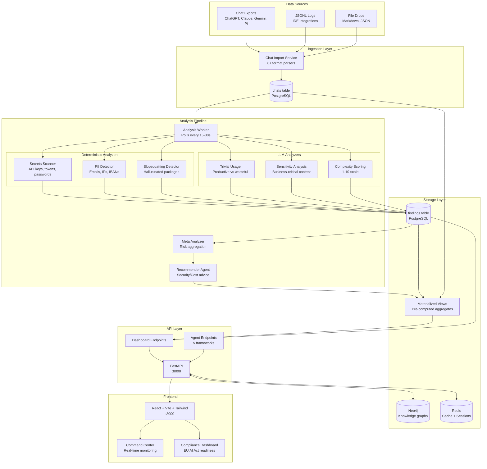

# Argus — AI Usage Intelligence

## Your developers are leaking secrets to AI — and nobody is watching.

Real-time secret detection. Malicious package scanning. Cost and compliance visibility.
Deployed on a Raspberry Pi you ship to any team — no cloud required, working in minutes.

> Full concept: [concept.md](docs/concept.md) | Architecture: [architecture.md](docs/architecture.md) | Pipeline: [docs/pipeline.md](docs/pipeline.md) | Data model: [data-model.md](docs/data-model.md)

---

## Core Idea

Argus enables companies to **govern their AI usage** and detect **data integrity leaks** before they become incidents. As enterprises rapidly adopt AI tools across departments, they lose visibility into what sensitive data is being shared with external models, which malicious packages AI might be hallucinating into install commands, and how costs are spiraling without attribution. Argus provides a centralized intelligence layer that monitors, analyzes, and secures all AI interactions — from ChatGPT conversations to Claude Code sessions. By maintaining a complete audit trail with pseudonymized attribution, companies can **stay compliant with emerging AI laws** (EU AI Act) and demonstrate regulatory readiness through a purpose-built overview tool. The platform runs entirely on-premise or on a Raspberry Pi, ensuring zero data egress while delivering enterprise-grade security insights.

---

## Architecture



---

## Quickstart

```bash
# 1. Create .env
cp .env.example .env
# → Add GOOGLE_API_KEY for LLM analysis

# 2. Start the stack (backend + frontend + postgres + redis)
docker compose up -d

# 3. Seed demo data
task seed-database
task import-chats

# 4. Open
# Frontend:  http://localhost:3000
# API docs:  http://localhost:8000/docs
```

### Useful commands

```bash
task up              # Start services
task down            # Stop services
task logs            # Tail logs
task test            # Run backend tests
task lint            # Lint backend
task nuke            # Stop + delete all volumes
```

---

## Stack

| Component | Tech | Port |
|-----------|------|------|
| **Backend** | FastAPI + Python 3.12 (uv) | `:8000` |
| **Worker** | Analysis pipeline (same image, sidecar) | — |
| **Frontend** | React + Vite + TailwindCSS | `:3000` |
| **Database** | PostgreSQL 16 | `:5432` |
| **LLM** | Gemini Flash (switchable via `MODEL_PROVIDER`) | — |

### Optional services

```bash
# Neo4j, ChromaDB, Rust worker
docker compose --profile extras up -d

# Observability (Jaeger, Prometheus, Grafana)
docker compose --profile observability up -d
```

---

## What It Does

1. **Import** — Ingests AI chat exports (ChatGPT, Gemini, Claude, Pi, AntiGravity)
2. **Scan** — Deterministic regex: secrets, PII, slopsquatting
3. **Analyze** — LLM analysis: trivial usage, sensitivity, complexity scoring
4. **Dashboard** — Materialized views → fast API endpoints → React frontend
5. **Agent** — Gemini-powered agent with tools to query findings in natural language

---

## Security & DSGVO

- No real user data in demo — all hashed/pseudonymized
- Secrets scanner runs on local LLMs too (on-device)
- LLM prompts use only anonymized aggregate data
- Audit-logging structured for EU AI Act compliance
