# Chat History Data Model — Claude Code & Pi Agent

> Analysis of local conversation storage formats across Claude Code and Pi Agent.
> Generated 2026-04-08.

---

## Overview

| Data Source | Location | Format | Records | Size |
|---|---|---|---|---|
| Prompt History | `~/.claude/history.jsonl` | JSONL (1 line per user prompt) | 3,200 | 896 KB |
| Conversations | `~/.claude/projects/<project-slug>/<session-id>.jsonl` | JSONL (1 line per event) | 2,894 files | 165.3 MB |
| Session Registry | `~/.claude/sessions/<pid>.json` | JSON (1 file per process) | 55 | 224 KB |
| Pi Sessions | `~/.pi/agent/sessions/--home-lars--/<timestamp>_<id>.jsonl` | JSONL (1 line per event) | 17 | 2.9 MB |

**Date range:** 2026-01-31 to 2026-04-08 (Claude Code), 2026-03-31 to 2026-04-07 (Pi Agent)

---

## 1. Prompt History — `~/.claude/history.jsonl`

A flat append-only log of every user prompt submitted across all sessions and projects. Used by `claude --resume` for the interactive session picker.

### Schema

```typescript
interface PromptHistoryEntry {
  display: string;            // The raw user input text
  pastedContents: Record<     // Pasted clipboard content (empty object when none)
    string,                   // Numeric key (e.g. "1")
    {
      id: number;
      type: "text";
      content?: string;       // Full text if small enough
      contentHash?: string;   // Hash reference if content was large
    }
  >;
  timestamp: number;          // Unix epoch in milliseconds
  project: string;            // Absolute path of the working directory
  sessionId: string;          // UUID v4 linking to conversation JSONL
}
```

### Example

```json
{
  "display": "fix the login bug on the /auth route",
  "pastedContents": {},
  "timestamp": 1775598381872,
  "project": "/home/lars",
  "sessionId": "cd429ed0-f563-4946-a6c6-e7925d52fee9"
}
```

### Notes
- 349 of 3,200 entries (10.9%) have non-empty `pastedContents`
- 339 unique sessions across 19 unique project paths
- Timestamps are JavaScript `Date.now()` (ms since epoch)

---

## 2. Conversations — `~/.claude/projects/<slug>/<session-id>.jsonl`

Full conversation transcripts. Each line is a typed event. The slug is the project path with `/` replaced by `-` (e.g. `-home-lars-Developer-PAI`).

### File Naming

```
~/.claude/projects/-home-lars/cd429ed0-f563-4946-a6c6-e7925d52fee9.jsonl
                   ^^^^^^^^^^^ ^^^^^^^^^^^^^^^^^^^^^^^^^^^^^^^^^^^^^^^^
                   project slug           session UUID
```

Some sessions also have a **directory** with the same UUID (for file-history backups):
```
~/.claude/projects/-home-lars/034e9d3e-5333-4e96-acc9-80669f6ec655/
~/.claude/projects/-home-lars/034e9d3e-5333-4e96-acc9-80669f6ec655.jsonl
```

### Event Types

| Type | Subtype | Count¹ | Description |
|---|---|---|---|
| `permission-mode` | — | 2 | Permission mode set/changed |
| `system` | `local_command` | 4 | Slash command invocation + output |
| `user` | — | 258 | User prompt or tool result |
| `attachment` | — | 1 | Companion/plugin attachment metadata |
| `assistant` | — | 352 | Model response (text, thinking, tool calls) |
| `file-history-snapshot` | — | 54 | File state checkpoint for undo |
| `queue-operation` | — | 4 | Message queue (enqueue/dequeue during interrupts) |
| `system` | `stop_hook_summary` | 31 | Post-response hook execution results |
| `system` | `turn_duration` | 16 | Turn timing metadata |
| `last-prompt` | — | 1 | Final prompt text (session footer) |

¹ Counts from session `cd429ed0` (1.9 MB, 258 user turns)

### Common Fields (all event types)

```typescript
interface BaseEvent {
  type: string;               // Event type discriminator
  uuid: string;               // Unique event ID (UUID v4)
  parentUuid: string | null;  // Links to preceding event (conversation tree)
  sessionId: string;          // Session UUID
  timestamp: string;          // ISO 8601 datetime
  isSidechain: boolean;       // Whether this is a branched/sidechain message
  cwd: string;                // Working directory at time of event
  entrypoint: string;         // "cli" | "ide" | etc.
  version: string;            // Claude Code version (e.g. "2.1.92")
  gitBranch: string;          // Current git branch (e.g. "HEAD", "main")
  userType: string;           // "external" (human) | "internal" (subagent)
}
```

### `type: "user"` — User Message

```typescript
interface UserEvent extends BaseEvent {
  type: "user";
  message: {
    role: "user";
    content: string | ContentBlock[];  // String for direct prompts, array for tool results
  };
  promptId: string;           // Unique prompt identifier
  permissionMode: string;     // "default" | "bypassPermissions" | "acceptEdits" | etc.
  slug?: string;              // Human-readable session name (e.g. "vivid-juggling-pie")
  sourceToolAssistantUUID?: string;  // If this is a tool result, links to the assistant turn
  toolUseResult?: string | {         // Tool result metadata
    content: string;
    is_error: boolean;
    tool_use_id: string;
    type: "tool_result";
  };
}
```

**User content when array (tool results):**

```typescript
type UserContentBlock =
  | { type: "text"; text: string }              // Interrupt text or annotations
  | { type: "tool_result";                      // Tool execution result
      tool_use_id: string;
      content: string;
      is_error: boolean;
    };
```

### `type: "assistant"` — Model Response

```typescript
interface AssistantEvent extends BaseEvent {
  type: "assistant";
  slug: string;               // Session slug
  message: {
    model: string;            // e.g. "claude-opus-4-6"
    id: string;               // API message ID (e.g. "msg_bdrk_014Qi...")
    type: "message";
    role: "assistant";
    content: AssistantContentBlock[];
    stop_reason: string;      // "end_turn" | "tool_use" | "max_tokens"
    stop_sequence: string | null;
    usage: {
      input_tokens: number;
      output_tokens: number;
      cache_creation_input_tokens: number;
      cache_read_input_tokens: number;
      server_tool_use?: object;
    };
  };
}
```

**Assistant content blocks:**

```typescript
type AssistantContentBlock =
  | { type: "thinking";                         // Extended thinking
      thinking: string;
      signature: string;                        // Cryptographic signature
    }
  | { type: "text";                             // Response text
      text: string;
    }
  | { type: "tool_use";                         // Tool invocation
      id: string;                               // Tool use ID (matches tool_result)
      name: string;                             // "Bash" | "Edit" | "Read" | "Write" | "Glob" | etc.
      input: Record<string, any>;               // Tool-specific parameters
    };
```

### `type: "file-history-snapshot"` — File Undo Checkpoint

```typescript
interface FileHistorySnapshot {
  type: "file-history-snapshot";
  messageId: string;          // Links to the user/assistant event that triggered it
  isSnapshotUpdate: boolean;  // Whether this updates an existing snapshot
  snapshot: {
    messageId: string;
    timestamp: string;
    trackedFileBackups: Record<
      string,                 // Relative file path (e.g. ".pi/.gitignore")
      {
        backupFileName: string;  // Hash-based backup filename
        version: number;
        backupTime: string;
      }
    >;
  };
}
```

### `type: "system", subtype: "stop_hook_summary"` — Hook Execution

```typescript
interface StopHookSummary extends BaseEvent {
  type: "system";
  subtype: "stop_hook_summary";
  level: string;              // "suggestion" | "info"
  hasOutput: boolean;
  hookCount: number;          // Number of hooks executed
  hookErrors: any[];
  hookInfos: Array<{
    command: string;          // Hook script path
    durationMs: number;
  }>;
  preventedContinuation: boolean;
  stopReason: string;
  toolUseID: string;
  slug: string;
}
```

### `type: "system", subtype: "turn_duration"` — Turn Metrics

```typescript
interface TurnDuration extends BaseEvent {
  type: "system";
  subtype: "turn_duration";
  durationMs: number;         // Total turn time in milliseconds
  messageCount: number;       // Messages in this turn
  isMeta: boolean;
  slug: string;
}
```

### `type: "permission-mode"` — Permission Change

```typescript
interface PermissionMode {
  type: "permission-mode";
  permissionMode: string;     // "default" | "bypassPermissions" | etc.
  sessionId: string;
}
```

### `type: "queue-operation"` — Message Queue

```typescript
interface QueueOperation {
  type: "queue-operation";
  operation: string;          // "enqueue" | "dequeue"
  content: string;            // The queued message text
  sessionId: string;
  timestamp: string;
}
```

### `type: "last-prompt"` — Session Footer

```typescript
interface LastPrompt {
  type: "last-prompt";
  lastPrompt: string;         // Text of the final user prompt
  sessionId: string;
}
```

### Conversation Tree Structure

Events form a **linked list / tree** via `parentUuid` → `uuid`:

```
permission-mode (root, parentUuid: null)
  └─ system:local_command (slash command)
       └─ system:local_command (output)
            └─ user (first prompt)
                 └─ attachment (companion intro)
                      └─ assistant (model response with tool_use)
                           └─ file-history-snapshot
                           └─ user (tool_result array)
                                └─ assistant (continues...)
                                     └─ system:stop_hook_summary
                                          └─ system:turn_duration
```

---

## 3. Session Registry — `~/.claude/sessions/<pid>.json`

Lightweight metadata indexed by OS process ID. Used to map running processes to sessions.

### Schema

```typescript
interface SessionRegistry {
  pid: number;                // OS process ID
  sessionId: string;          // UUID v4 linking to conversation JSONL
  cwd: string;                // Working directory
  startedAt: number;          // Unix epoch in milliseconds
  kind: string;               // "interactive" (always observed)
  entrypoint: string;         // "cli" (always observed)
}
```

### Example

```json
{
  "pid": 6783,
  "sessionId": "2b84b6c1-bd63-4b7e-bb07-36281d452218",
  "cwd": "/home/lars",
  "startedAt": 1775661877651,
  "kind": "interactive",
  "entrypoint": "cli"
}
```

### Notes
- Files are **not cleaned up** when processes exit (55 files, many for dead PIDs)
- Filename is the PID, not the session ID

---

## 4. Pi Agent Sessions — `~/.pi/agent/sessions/--home-lars--/`

Pi uses a different JSONL format with shorter IDs and a different event taxonomy.

### File Naming

```
2026-04-02T07-54-25-828Z_1881fd53-9722-4357-9b9b-2c8b00486495.jsonl
^^^^^^^^^^^^^^^^^^^^^^^^^^ ^^^^^^^^^^^^^^^^^^^^^^^^^^^^^^^^^^^^^^^^
ISO 8601 timestamp (- for :)               session UUID
```

### Event Types

| Type | Count¹ | Description |
|---|---|---|
| `session` | 1 | Session initialization (version, cwd) |
| `model_change` | 1 | Model selection event |
| `thinking_level_change` | 1 | Thinking level configuration |
| `message` | 69 | All conversation messages (user, assistant, toolResult) |
| `compaction` | 5 | Context window compression events |
| `custom` | 3 | Extension-specific events (e.g. web search results) |

¹ Counts from session `1881fd53` (1,062 KB, largest session)

### Common Fields

```typescript
interface PiBaseEvent {
  type: string;               // Event type discriminator
  id: string;                 // Short hex ID (8 chars, e.g. "6580b300")
  parentId: string | null;    // Links to preceding event
  timestamp: string;          // ISO 8601 datetime
}
```

### `type: "session"` — Session Init

```typescript
interface PiSession extends PiBaseEvent {
  type: "session";
  cwd: string;
  version: number;            // Schema version (observed: 3)
}
```

### `type: "model_change"` — Model Selection

```typescript
interface PiModelChange extends PiBaseEvent {
  type: "model_change";
  modelId: string;            // e.g. "claude-sonnet-4-6"
  provider: string;           // e.g. "dt-llmchat"
}
```

### `type: "thinking_level_change"`

```typescript
interface PiThinkingLevel extends PiBaseEvent {
  type: "thinking_level_change";
  thinkingLevel: string;      // "high" | "medium" | "low"
}
```

### `type: "message"` — All Conversation Messages

Pi wraps all roles in a single `message` type with role discrimination inside:

```typescript
interface PiMessage extends PiBaseEvent {
  type: "message";
  message: {
    role: "user" | "assistant" | "toolResult";
    content: PiContentBlock[];
    timestamp?: number;       // Epoch ms (on user messages)
  };
}
```

**Content blocks by role:**

```typescript
// User messages
type PiUserContent = { type: "text"; text: string };

// Assistant messages
type PiAssistantContent =
  | { type: "thinking"; thinking: string; thinkingSignature: "reasoning_content" }
  | { type: "text"; text: string }
  | { type: "toolCall"; id: string; name: string; arguments: Record<string, any> };

// Tool results
type PiToolResultContent =
  | { type: "text"; text: string }
  | { type: "image"; data: string; mimeType: string };   // Base64 encoded
```

### `type: "compaction"` — Context Compression

```typescript
interface PiCompaction extends PiBaseEvent {
  type: "compaction";
  summary: string;            // Markdown summary of compacted context
  tokensBefore: number;       // Token count before compaction
  firstKeptEntryId: string;   // ID of first event kept after compaction
  fromHook: boolean;          // Whether triggered by a hook
  details: {
    readFiles: string[];      // Files read during compacted portion
    // ... additional metadata
  };
}
```

### `type: "custom"` — Extension Events

```typescript
interface PiCustomEvent extends PiBaseEvent {
  type: "custom";
  customType: string;         // e.g. "web-search-results"
  data: Record<string, any>;  // Extension-specific payload
}
```

---

## Cross-Reference: Claude Code vs Pi Agent

| Aspect | Claude Code | Pi Agent |
|---|---|---|
| **ID format** | UUID v4 (36 chars) | Short hex (8 chars) |
| **Event linking** | `parentUuid` → `uuid` | `parentId` → `id` |
| **Message typing** | Separate `type: "user"` / `type: "assistant"` | Single `type: "message"` with `message.role` |
| **Tool calls** | `type: "tool_use"` in content blocks | `type: "toolCall"` in content blocks |
| **Tool results** | Separate `type: "user"` event with `tool_result` content | Separate `type: "message"` with `role: "toolResult"` |
| **Thinking** | `signature` field (crypto) | `thinkingSignature: "reasoning_content"` |
| **Context management** | Server-side (no local compaction events) | `type: "compaction"` with summary + token counts |
| **File tracking** | `file-history-snapshot` events with backups | Not present |
| **Hooks** | `stop_hook_summary` events | Not present |
| **Metrics** | `turn_duration` events | Not present |
| **Session metadata** | Separate `sessions/<pid>.json` registry | Inline `type: "session"` event |
| **Slug naming** | `slug` field on events (e.g. "vivid-juggling-pie") | Not present |
| **File naming** | `<session-uuid>.jsonl` | `<iso-timestamp>_<session-uuid>.jsonl` |

---

## Access Methods

### Claude Code

```bash
# Resume interactively (fuzzy search)
claude --resume

# Resume specific session
claude --resume cd429ed0-f563-4946-a6c6-e7925d52fee9

# Continue most recent in current directory
claude --continue

# Fork a session (new ID, same history)
claude --resume <id> --fork-session

# Extract all user prompts from a session
python3 -c "
import json
with open('$HOME/.claude/projects/-home-lars/<session-id>.jsonl') as f:
    for line in f:
        obj = json.loads(line)
        if obj.get('type') == 'user':
            msg = obj['message']['content']
            if isinstance(msg, str):
                print(f'[{obj[\"timestamp\"]}] {msg[:120]}')
"
```

### Pi Agent

```bash
# Resume last session
pi --resume

# Sessions are in chronologically-named files
ls ~/.pi/agent/sessions/--home-lars--/
```

---

## Data Model Diagram

```mermaid
---
title: Chat History Data Model — Claude Code & Pi Agent
---
classDiagram
    direction TB

    %% ──────────────────────────────────────
    %% CLAUDE CODE — Prompt History
    %% ──────────────────────────────────────

    class PromptHistoryEntry {
        <<~/.claude/history.jsonl>>
        +string display
        +Map~string, PastedContent~ pastedContents
        +int timestamp
        +string project
        +string sessionId
    }

    class PastedContent {
        +int id
        +string type = "text"
        +string? content
        +string? contentHash
    }

    PromptHistoryEntry "1" *-- "0..*" PastedContent : pastedContents

    %% ──────────────────────────────────────
    %% CLAUDE CODE — Session Registry
    %% ──────────────────────────────────────

    class SessionRegistry {
        <<~/.claude/sessions/pid.json>>
        +int pid
        +string sessionId
        +string cwd
        +int startedAt
        +string kind
        +string entrypoint
    }

    %% ──────────────────────────────────────
    %% CLAUDE CODE — Conversation Events
    %% ──────────────────────────────────────

    class CCBaseEvent {
        <<abstract>>
        +string type
        +string uuid
        +string? parentUuid
        +string sessionId
        +string timestamp
        +bool isSidechain
        +string cwd
        +string entrypoint
        +string version
        +string gitBranch
        +string userType
    }

    class CCUserEvent {
        +string type = "user"
        +CCUserMessage message
        +string promptId
        +string permissionMode
        +string? slug
        +string? sourceToolAssistantUUID
    }

    class CCUserMessage {
        +string role = "user"
        +string|ContentBlock[] content
    }

    class CCAssistantEvent {
        +string type = "assistant"
        +string slug
        +CCAssistantMessage message
    }

    class CCAssistantMessage {
        +string model
        +string id
        +string role = "assistant"
        +AssistantContentBlock[] content
        +string stop_reason
        +string? stop_sequence
        +Usage usage
    }

    class Usage {
        +int input_tokens
        +int output_tokens
        +int cache_creation_input_tokens
        +int cache_read_input_tokens
    }

    class ThinkingBlock {
        +string type = "thinking"
        +string thinking
        +string signature
    }

    class TextBlock {
        +string type = "text"
        +string text
    }

    class ToolUseBlock {
        +string type = "tool_use"
        +string id
        +string name
        +Map~string, any~ input
    }

    class ToolResultBlock {
        +string type = "tool_result"
        +string tool_use_id
        +string content
        +bool is_error
    }

    class FileHistorySnapshot {
        +string type = "file-history-snapshot"
        +string messageId
        +bool isSnapshotUpdate
        +Snapshot snapshot
    }

    class Snapshot {
        +string messageId
        +string timestamp
        +Map~string, FileBackup~ trackedFileBackups
    }

    class FileBackup {
        +string backupFileName
        +int version
        +string backupTime
    }

    class StopHookSummary {
        +string type = "system"
        +string subtype = "stop_hook_summary"
        +string level
        +bool hasOutput
        +int hookCount
        +any[] hookErrors
        +HookInfo[] hookInfos
        +bool preventedContinuation
        +string stopReason
        +string toolUseID
    }

    class HookInfo {
        +string command
        +int durationMs
    }

    class TurnDuration {
        +string type = "system"
        +string subtype = "turn_duration"
        +int durationMs
        +int messageCount
        +bool isMeta
    }

    class PermissionMode {
        +string type = "permission-mode"
        +string permissionMode
        +string sessionId
    }

    class QueueOperation {
        +string type = "queue-operation"
        +string operation
        +string content
        +string sessionId
        +string timestamp
    }

    class Attachment {
        +string type = "attachment"
        +Map~string, any~ attachment
    }

    class LastPrompt {
        +string type = "last-prompt"
        +string lastPrompt
        +string sessionId
    }

    %% Inheritance
    CCBaseEvent <|-- CCUserEvent
    CCBaseEvent <|-- CCAssistantEvent
    CCBaseEvent <|-- StopHookSummary
    CCBaseEvent <|-- TurnDuration
    CCBaseEvent <|-- Attachment

    %% Compositions
    CCUserEvent "1" *-- "1" CCUserMessage
    CCUserMessage "1" *-- "0..*" ToolResultBlock : content (when array)
    CCAssistantEvent "1" *-- "1" CCAssistantMessage
    CCAssistantMessage "1" *-- "1..*" ThinkingBlock : content
    CCAssistantMessage "1" *-- "1..*" TextBlock : content
    CCAssistantMessage "1" *-- "0..*" ToolUseBlock : content
    CCAssistantMessage "1" *-- "1" Usage
    FileHistorySnapshot "1" *-- "1" Snapshot
    Snapshot "1" *-- "0..*" FileBackup : trackedFileBackups
    StopHookSummary "1" *-- "0..*" HookInfo

    %% Tool call ↔ result linkage
    ToolUseBlock "1" ..> "1" ToolResultBlock : id ↔ tool_use_id

    %% Cross-file references
    PromptHistoryEntry "0..*" ..> "1" SessionRegistry : sessionId
    SessionRegistry "1" ..> "1" CCBaseEvent : sessionId → JSONL file

    %% ──────────────────────────────────────
    %% PI AGENT — Session Events
    %% ──────────────────────────────────────

    class PiBaseEvent {
        <<abstract>>
        +string type
        +string id
        +string? parentId
        +string timestamp
    }

    class PiSession {
        +string type = "session"
        +string cwd
        +int version
    }

    class PiModelChange {
        +string type = "model_change"
        +string modelId
        +string provider
    }

    class PiThinkingLevel {
        +string type = "thinking_level_change"
        +string thinkingLevel
    }

    class PiMessage {
        +string type = "message"
        +PiMessageBody message
    }

    class PiMessageBody {
        +string role
        +PiContentBlock[] content
        +int? timestamp
    }

    class PiThinkingBlock {
        +string type = "thinking"
        +string thinking
        +string thinkingSignature
    }

    class PiTextBlock {
        +string type = "text"
        +string text
    }

    class PiToolCallBlock {
        +string type = "toolCall"
        +string id
        +string name
        +Map~string, any~ arguments
    }

    class PiImageBlock {
        +string type = "image"
        +string data
        +string mimeType
    }

    class PiCompaction {
        +string type = "compaction"
        +string summary
        +int tokensBefore
        +string firstKeptEntryId
        +bool fromHook
        +CompactionDetails details
    }

    class CompactionDetails {
        +string[] readFiles
    }

    class PiCustomEvent {
        +string type = "custom"
        +string customType
        +Map~string, any~ data
    }

    %% Inheritance
    PiBaseEvent <|-- PiSession
    PiBaseEvent <|-- PiModelChange
    PiBaseEvent <|-- PiThinkingLevel
    PiBaseEvent <|-- PiMessage
    PiBaseEvent <|-- PiCompaction
    PiBaseEvent <|-- PiCustomEvent

    %% Compositions
    PiMessage "1" *-- "1" PiMessageBody
    PiMessageBody "1" *-- "0..*" PiThinkingBlock : content
    PiMessageBody "1" *-- "0..*" PiTextBlock : content
    PiMessageBody "1" *-- "0..*" PiToolCallBlock : content
    PiMessageBody "1" *-- "0..*" PiImageBlock : content
    PiCompaction "1" *-- "1" CompactionDetails

    %% ──────────────────────────────────────
    %% GROUPING via namespaces
    %% ──────────────────────────────────────

    namespace ClaudeCode_PromptHistory {
        class PromptHistoryEntry
        class PastedContent
    }

    namespace ClaudeCode_SessionRegistry {
        class SessionRegistry
    }

    namespace ClaudeCode_ConversationEvents {
        class CCBaseEvent
        class CCUserEvent
        class CCUserMessage
        class CCAssistantEvent
        class CCAssistantMessage
        class Usage
        class ThinkingBlock
        class TextBlock
        class ToolUseBlock
        class ToolResultBlock
        class FileHistorySnapshot
        class Snapshot
        class FileBackup
        class StopHookSummary
        class HookInfo
        class TurnDuration
        class PermissionMode
        class QueueOperation
        class Attachment
        class LastPrompt
    }

    namespace PiAgent_SessionEvents {
        class PiBaseEvent
        class PiSession
        class PiModelChange
        class PiThinkingLevel
        class PiMessage
        class PiMessageBody
        class PiThinkingBlock
        class PiTextBlock
        class PiToolCallBlock
        class PiImageBlock
        class PiCompaction
        class CompactionDetails
        class PiCustomEvent
    }
```


