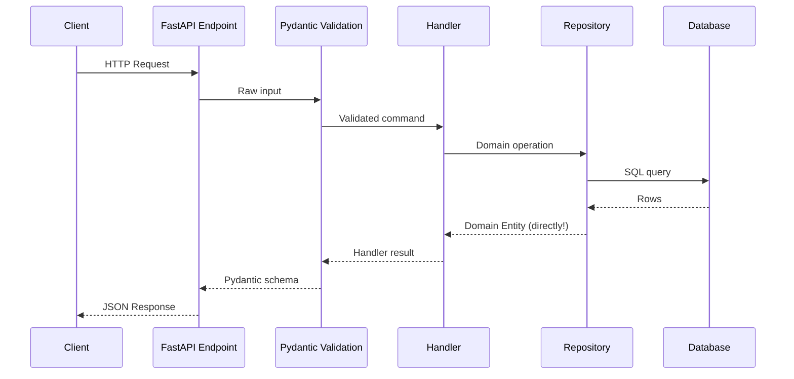
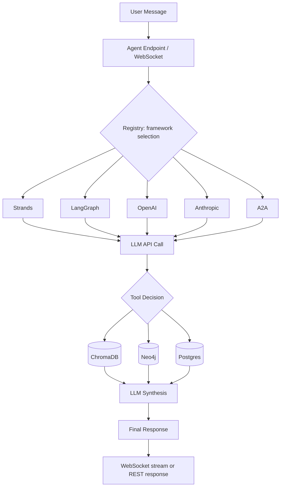
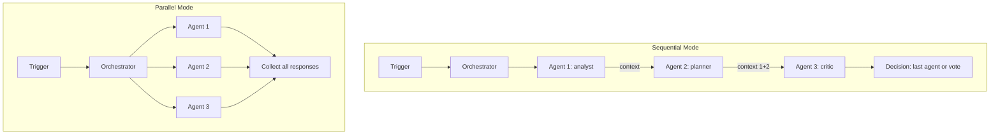
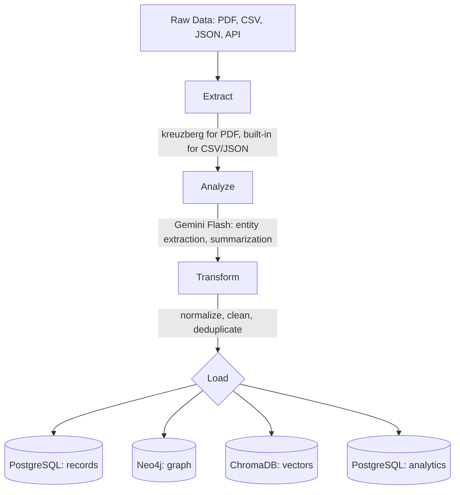
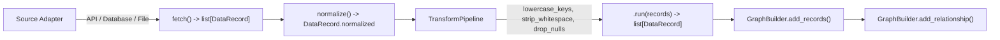
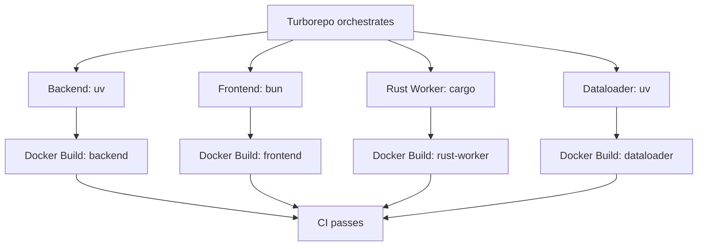
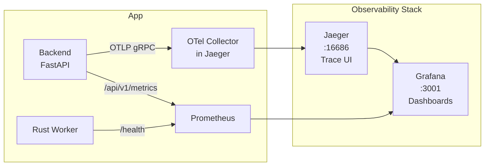

# System Architecture

## Full Architecture Diagram

```
+------------------------------------------------------------------+
|                          CLIENTS                                  |
|  Browser (:3000)            Mobile            CLI / Scripts       |
+----------+------------------+------------------+-----------------+
           |                                     |
           v                                     v
+----------+-------------------------------------+-----------------+
|                     API GATEWAY                                  |
|                  FastAPI (:8000)                                  |
|                                                                  |
|  /api/v1/auth/*   /api/v1/agents/*   /api/v1/data/*   /health   |
+----------+---------------------------------------------------+---+
           |                                                   |
           v                                                   v
+----------+--------------+                  +-----------------+---+
|   APPLICATION LAYER     |                  |   AGENT MODULE      |
|                         |                  |                     |
|  Commands -> Handlers   |                  |  5 Frameworks:      |
|  CreateUser, LoginUser  |<-----------------+  Strands, LangGraph |
|  (use cases)            |   uses handlers  |  OpenAI, Anthropic  |
|                         |                  |  A2A + Orchestrator |
+-----------+-------------+                  +--+-------+----------+
            |                                   |       |
            v                                   v       v
+-----------+-------------+         +-----------+--+ +--+-----------+
|    DOMAIN LAYER         |         |   LLM APIs   | | Tool Calls   |
|                         |         |              | |              |
|  Entities (dataclasses) |         | AWS Bedrock  | | ChromaDB     |
|  Interfaces (ABC)       |         | OpenAI       | | Neo4j        |
|  Business Rules         |         | Anthropic    | | Postgres     |
|  NO framework imports   |         | Google       | | PostgreSQL   |
+-------------------------+         +--------------+ +--------------+
            ^
            | map_imperatively()
+-----------+-------------------+
|  INFRASTRUCTURE LAYER         |
|                               |
|  mapping.py (imperative map)  |
|  Repositories (direct entity) |
|  PostgreSQL analytics views   |
|  Data mapping (ETL pipeline)  |
|  External service clients     |
+------+------+---------+------+
       |      |         |
       v      v         v
+------+-+  +-+------+  +--------+  +-------+
|Postgres|  | Neo4j  |  |ChromaDB|  | Redis |
| :5432  |  | :7687  |  | :8100  |  | :6379 |
+--------+  +--------+  +--------+  +-------+
    CRUD       Graphs      Vectors     Cache
    primary    knowledge   RAG/search  sessions
```

## Imperative Mapping (DDD Core)

The key architectural decision: **domain entities are mapped to SQL tables imperatively**, not via ORM base classes.

```
WRONG (declarative -- leaks SQLAlchemy into domain):
  class UserModel(Base):             # ORM class
      __tablename__ = "users"
      id = mapped_column(UUID...)

  class User:                        # Domain entity
      id: UUID
      email: str

  # Repository must convert between the two:
  def _to_entity(model: UserModel) -> User:  # tedious, error-prone
```

```
CORRECT (imperative -- domain stays pure):
  # domain/entities.py -- pure dataclass
  @dataclass
  class User:
      id: UUID
      email: str

  # infrastructure/mapping.py -- separate mapping
  users_table = Table("users", metadata, Column("id", UUID...), ...)
  mapper_registry.map_imperatively(User, users_table)

  # Repository works directly with User:
  result = await session.execute(select(User).where(User.email == email))
  user = result.scalar_one_or_none()  # returns User dataclass directly
```

This means:
- Domain entities are THE mapped objects -- no conversion layer
- Repositories use `select(User)` directly, get `User` back
- Adding a new entity = dataclass + table + one `map_imperatively()` call
- Alembic sees the tables via shared `metadata` object

## Data Flow

### 1. HTTP Request Flow



### 2. Agent Execution Flow



### 3. Multi-Agent Orchestrator Flow



### 4. Dataloader Pipeline



### 5. Data Mapping Pipeline



## Build Pipeline



## Database Schema

Full schema definition with column details: see [docs/data-model.md](data-model.md).

### PostgreSQL -- Primary CRUD

Tables defined via imperative mapping in `app/infrastructure/mapping.py`:

- **users** -- auth + profile (email, password, name, active status)
- **documents** -- ingested document metadata (title, source, type, preview)
- **data_sources** -- registered external data sources (connection strings, sync status)

Adding new tables:
1. Dataclass in `app/domain/entities.py`
2. Table + `map_imperatively()` in `app/infrastructure/mapping.py`
3. `task migration -- "add_table_name"` then `task migrate`

### Neo4j -- Knowledge Graphs

See [docs/data-model.md](data-model.md) for the full graph schema diagram.

Populated by dataloader (Gemini entity extraction) and data mapping pipeline (GraphBuilder).

### ChromaDB -- Vector Search / RAG

Collections: `documents` (ingested docs), `knowledge_base` (domain-specific).
Populated by dataloader. Queried by agent tools for context retrieval.

### Redis -- Cache + Queues

Keys: `session:{uid}`, `cache:{key}`, `ratelimit:{ip}`, `queue:{name}`.

### PostgreSQL -- Analytics

Analytics workloads run in PostgreSQL using SQL queries and materialized views.
Use scheduled refresh jobs for heavy reporting views.

## Observability Stack (Optional)

Enable with: `docker compose --profile observability up -d` + `OTEL_ENABLED=true`



### Components

| Service | Port | Purpose | Profile |
|---|---|---|---|
| **Jaeger** | 16686 (UI), 4317 (OTLP) | Distributed tracing — view spans, latency, service deps | `observability` |
| **Prometheus** | 9090 | Metrics collection — scrapes `/api/v1/metrics` | `observability` |
| **Grafana** | 3001 | Dashboards — pre-configured with Jaeger + Prometheus datasources | `observability` |

### What Gets Traced (when `OTEL_ENABLED=true`)

OpenTelemetry auto-instruments these frameworks:
- **FastAPI** — every HTTP request becomes a span (method, path, status, duration)
- **SQLAlchemy** — every DB query becomes a child span (query text, table, duration)
- **Redis** — every Redis command becomes a child span
- **httpx** — every outgoing HTTP call (agent API calls to LLM providers)

Example trace for an agent invocation:
```
POST /api/v1/agents/invoke (320ms)
  ├── invoke_agent (315ms)
  │   ├── httpx.request POST anthropic.com/v1/messages (280ms)
  │   └── chromadb.query (12ms)
  └── sqlalchemy.execute SELECT users (3ms)
```

### Manual Spans

For custom tracing in agent or business logic:
```python
from app.telemetry import get_tracer

tracer = get_tracer()
with tracer.start_as_current_span("custom_operation") as span:
    span.set_attribute("agent.framework", "anthropic")
    result = await do_something()
    span.set_attribute("result.length", len(result))
```

### When to Enable

- **Hackathon day 1**: Don't. Focus on building.
- **Hackathon day 2**: If agent calls are slow and you can't tell why — enable it.
- **Demo/production**: Always. It's free visibility.
- **Judges ask about observability**: Show them Jaeger with a real trace. Instant points.
