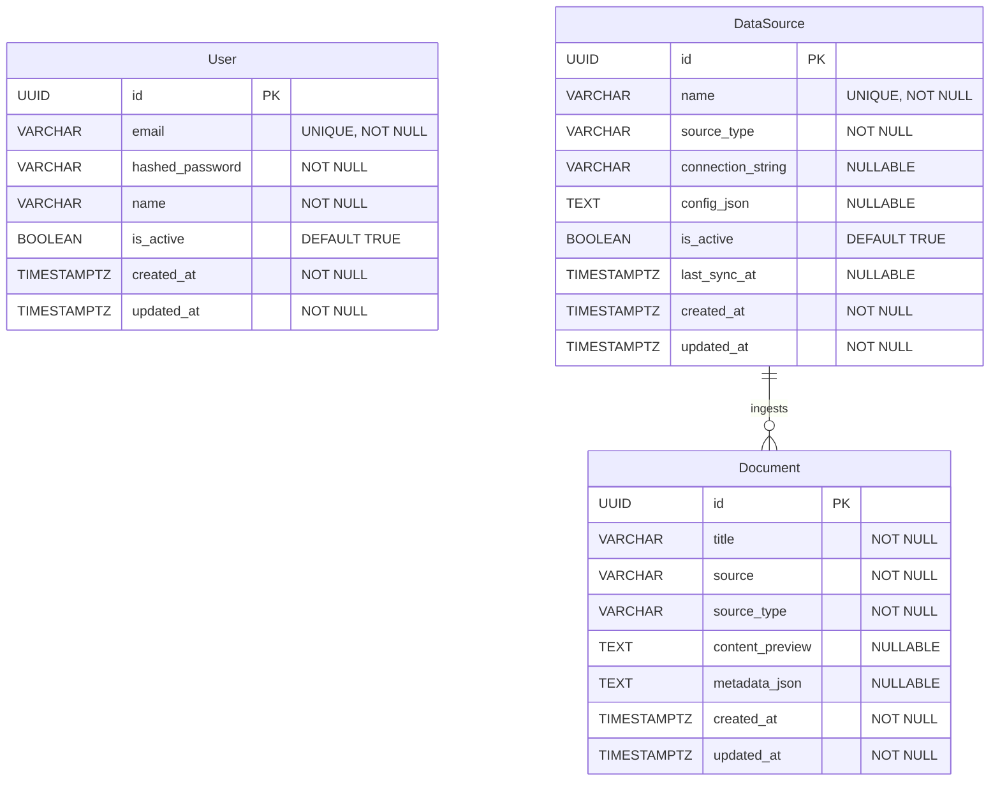
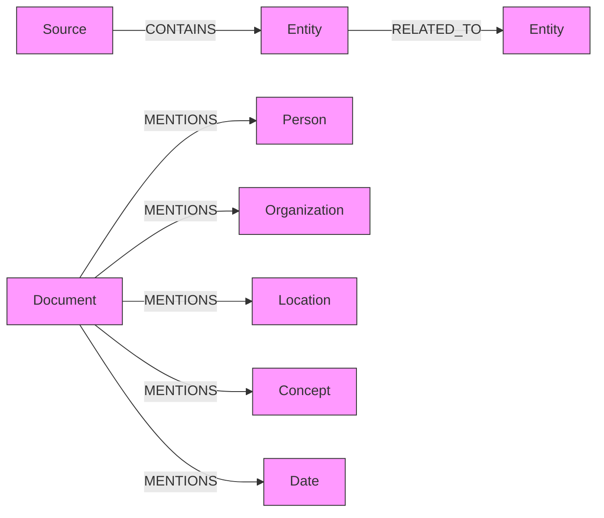

# Data Model

## Entity Relationship Diagram



## PostgreSQL Tables (via Imperative Mapping)

All tables are defined in `app/infrastructure/mapping.py` and mapped to domain entities in `app/domain/entities.py`.

### users
| Column | Type | Constraints |
|---|---|---|
| id | UUID | PK |
| email | VARCHAR(255) | UNIQUE, NOT NULL, INDEX |
| hashed_password | VARCHAR(255) | NOT NULL |
| name | VARCHAR(255) | NOT NULL |
| is_active | BOOLEAN | DEFAULT TRUE |
| created_at | TIMESTAMPTZ | NOT NULL |
| updated_at | TIMESTAMPTZ | NOT NULL |

### documents
| Column | Type | Constraints |
|---|---|---|
| id | UUID | PK |
| title | VARCHAR(500) | NOT NULL |
| source | VARCHAR(1000) | NOT NULL |
| source_type | VARCHAR(50) | NOT NULL |
| content_preview | TEXT | NULLABLE |
| metadata_json | TEXT | NULLABLE |
| created_at | TIMESTAMPTZ | NOT NULL |
| updated_at | TIMESTAMPTZ | NOT NULL |

### data_sources
| Column | Type | Constraints |
|---|---|---|
| id | UUID | PK |
| name | VARCHAR(255) | UNIQUE, NOT NULL |
| source_type | VARCHAR(50) | NOT NULL |
| connection_string | VARCHAR(1000) | NULLABLE |
| config_json | TEXT | NULLABLE |
| is_active | BOOLEAN | DEFAULT TRUE |
| last_sync_at | TIMESTAMPTZ | NULLABLE |
| created_at | TIMESTAMPTZ | NOT NULL |
| updated_at | TIMESTAMPTZ | NOT NULL |

## Neo4j Graph Schema

Nodes and relationships for knowledge graphs. Populated by dataloader + data mapping.



**Node properties:**

| Node | Properties |
|---|---|
| Source | name, type |
| Entity | name, type |
| Document | id, title, source |
| Person | name |
| Organization | name |
| Location | name |
| Concept | name |
| Date | value |

## ChromaDB Collections

| Collection | Content | Populated By |
|---|---|---|
| `documents` | Ingested document chunks with embeddings | Dataloader |
| `knowledge_base` | Domain-specific knowledge for RAG | Manual / API |

## DuckDB Tables

DuckDB tables are created dynamically from file ingestion:

```sql
-- Direct file queries (no import needed)
SELECT * FROM read_csv('resources/data/dataset.csv');
SELECT * FROM read_parquet('resources/data/*.parquet');
SELECT * FROM read_json('resources/data/events.json');

-- Materialized tables
CREATE TABLE insights AS SELECT ... FROM read_csv('...');
```

## Redis Keys

| Pattern | Type | Purpose |
|---|---|---|
| `session:{user_id}` | STRING | User session data |
| `cache:{key}` | STRING | General cache (TTL-based) |
| `ratelimit:{ip}` | STRING | Rate limiting counters |
| `queue:{name}` | LIST | Task queue |

## Adding New Entities

1. Add dataclass to `app/domain/entities.py`
2. Add table + mapping to `app/infrastructure/mapping.py`
3. Add repository interface to `app/domain/interfaces.py`
4. Add repository implementation to `app/infrastructure/repositories/`
5. Run `task migration -- "add_entity_name"` then `task migrate`

The imperative mapping ensures your domain entity stays pure -- SQLAlchemy never touches it directly.
