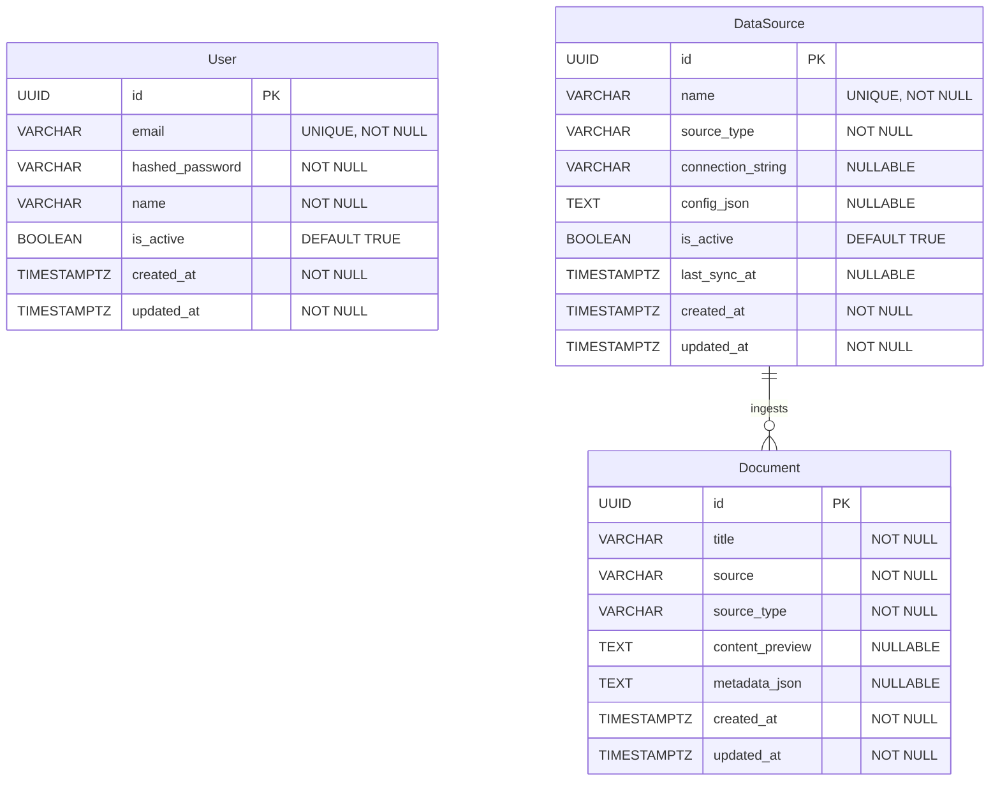
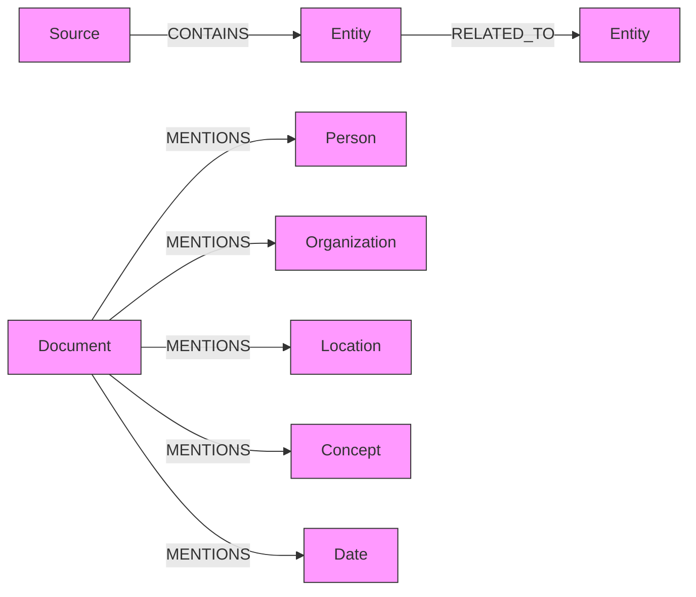

# Data Model

## Entity Relationship Diagram

## PostgreSQL Tables (via Imperative Mapping)

All tables are defined in `app/infrastructure/mapping.py` and mapped to domain entities in `app/domain/entities.py`.

### users
| Column | Type | Constraints |
|---|---|---|
| id | UUID | PK |
| email | VARCHAR(255) | UNIQUE, NOT NULL, INDEX |
| hashed_password | VARCHAR(255) | NOT NULL |
| name | VARCHAR(255) | NOT NULL |
| is_active | BOOLEAN | DEFAULT TRUE |
| created_at | TIMESTAMPTZ | NOT NULL |
| updated_at | TIMESTAMPTZ | NOT NULL |

### documents
| Column | Type | Constraints |
|---|---|---|
| id | UUID | PK |
| title | VARCHAR(500) | NOT NULL |
| source | VARCHAR(1000) | NOT NULL |
| source_type | VARCHAR(50) | NOT NULL |
| content_preview | TEXT | NULLABLE |
| metadata_json | TEXT | NULLABLE |
| created_at | TIMESTAMPTZ | NOT NULL |
| updated_at | TIMESTAMPTZ | NOT NULL |

### data_sources
| Column | Type | Constraints |
|---|---|---|
| id | UUID | PK |
| name | VARCHAR(255) | UNIQUE, NOT NULL |
| source_type | VARCHAR(50) | NOT NULL |
| connection_string | VARCHAR(1000) | NULLABLE |
| config_json | TEXT | NULLABLE |
| is_active | BOOLEAN | DEFAULT TRUE |
| last_sync_at | TIMESTAMPTZ | NULLABLE |
| created_at | TIMESTAMPTZ | NOT NULL |
| updated_at | TIMESTAMPTZ | NOT NULL |

## Neo4j Graph Schema

Nodes and relationships for knowledge graphs. Populated by dataloader + data mapping.

**Node properties:**

| Node | Properties |
|---|---|
| Source | name, type |
| Entity | name, type |
| Document | id, title, source |
| Person | name |
| Organization | name |
| Location | name |
| Concept | name |
| Date | value |

## ChromaDB Collections

| Collection | Content | Populated By |
|---|---|---|
| `documents` | Ingested document chunks with embeddings | Dataloader |
| `knowledge_base` | Domain-specific knowledge for RAG | Manual / API |

## Analysis Pipeline Tables (via SQL scripts)

These tables are defined in `src/backend/scripts/postgres/` and populated by the analysis worker.

### chats (002_chats_schema.sql)
| Column | Type | Notes |
|---|---|---|
| `id` | BIGSERIAL PK | |
| `source_file` | TEXT | Absolute path of source file |
| `source_format` | VARCHAR(20) | `json`, `jsonl`, `markdown` |
| `provider` | VARCHAR(50) | `chatgpt`, `gemini`, `claude_code`, `pi_agent`, `antigravity` |
| `conversation_key` | TEXT | Groups messages into conversations |
| `conversation_title` | TEXT | Human-readable title |
| `model_name` | VARCHAR(100) | e.g. `gpt-4o`, `claude-opus-4-6` |
| `author` | VARCHAR(20) | `user` or `model` |
| `user_text` | TEXT | Raw message content |
| `user_text_clean` | TEXT | Cleaned: URLs, emails, secrets redacted |
| `user_text_hash` | CHAR(64) | SHA-256 of cleaned text (dedup) |
| `metadata` | JSONB | Provider-specific extra fields |

### findings (003_findings_schema.sql)
| Column | Type | Notes |
|---|---|---|
| `id` | BIGSERIAL PK | |
| `chat_id` | BIGINT FK → chats.id | |
| `analyzer` | VARCHAR(50) | `secrets`, `pii`, `slopsquatting`, `llm_trivial`, `llm_sensitivity`, `llm_complexity` |
| `category` | VARCHAR(50) | `security_leak`, `content_leak`, `supply_chain`, `usage_quality`, `complexity` |
| `severity` | VARCHAR(20) | `critical`, `high`, `medium`, `low`, `info` |
| `title` | VARCHAR(500) | Human-readable finding |
| `detail` | TEXT | Explanation / context |
| `snippet` | TEXT | Matched text or relevant excerpt |
| `confidence` | REAL | 1.0 for deterministic, 0.0-1.0 for LLM |
| `meta` | JSONB | Analyzer-specific structured data |

### deterministic_company_rules (003_deterministic_analysis_schema.sql)
| Column | Type | Notes |
|---|---|---|
| `id` | TEXT PK | Stable hash ID |
| `source_table` | TEXT | `employees`, `costumers`, `documents` |
| `source_field` | TEXT | Column that generated this rule |
| `label` | TEXT | Human-readable label |
| `category` | VARCHAR(20) | `pii`, `secret` |
| `severity` | VARCHAR(20) | `critical`, `high`, `medium` |
| `pattern` | TEXT | Regex pattern |
| `active` | BOOLEAN | Whether rule is active |

### conversation_insights (005_insights_schema.sql)
| Column | Type | Notes |
|---|---|---|
| `id` | UUID PK | |
| `chat_id` | BIGINT FK → chats.id | |
| `run_id` | TEXT | |
| `risk_score` | INTEGER | 0-100 calculated by MetaAnalyzer |
| `risk_factors` | JSONB | List of reasons |
| `summary` | TEXT | 1-2 sentence executive summary |
| `created_at` | TIMESTAMPTZ | |

### system_recommendations (006_recommendations_schema.sql)
| Column | Type | Notes |
|---|---|---|
| `id` | UUID PK | |
| `category` | VARCHAR(50) | `security`, `cost`, `compliance`, `training` |
| `title` | TEXT | Short recommendation title |
| `description` | TEXT | The detailed guidance / instruction |
| `impact_score` | INTEGER | 0-100 derived by Recommender LLM |
| `target_audience` | VARCHAR(100) | e.g. "Engineering" |
| `status` | VARCHAR(20) | `active`, `historical` |
| `created_at` | TIMESTAMPTZ | |

### Materialized Views (004_dashboard_views.sql)
| View | Purpose |
|---|---|
| `mv_dashboard_overview` | Single-row totals: messages, conversations, findings by severity |
| `mv_findings_by_category` | Finding counts by category + severity + provider |
| `mv_provider_stats` | Per-provider message count, leak counts, avg complexity |
| `mv_findings_timeline` | Daily findings per category (sparklines) |
| `mv_top_findings` | Top 100 critical/high findings (alert feed) |
| `mv_scatter_complexity_leaks` | Complexity vs leak count per conversation (scatter plot) |

## Redis Keys

| Pattern | Type | Purpose |
|---|---|---|
| `session:{user_id}` | STRING | User session data |
| `cache:{key}` | STRING | General cache (TTL-based) |
| `ratelimit:{ip}` | STRING | Rate limiting counters |
| `queue:{name}` | LIST | Task queue |

## Adding New Entities

1. Add dataclass to `app/domain/entities.py`
2. Add table + mapping to `app/infrastructure/mapping.py`
3. Add repository interface to `app/domain/interfaces.py`
4. Add repository implementation to `app/infrastructure/repositories/`
5. Run `task migration -- "add_entity_name"` then `task migrate`

The imperative mapping ensures your domain entity stays pure -- SQLAlchemy never touches it directly.
